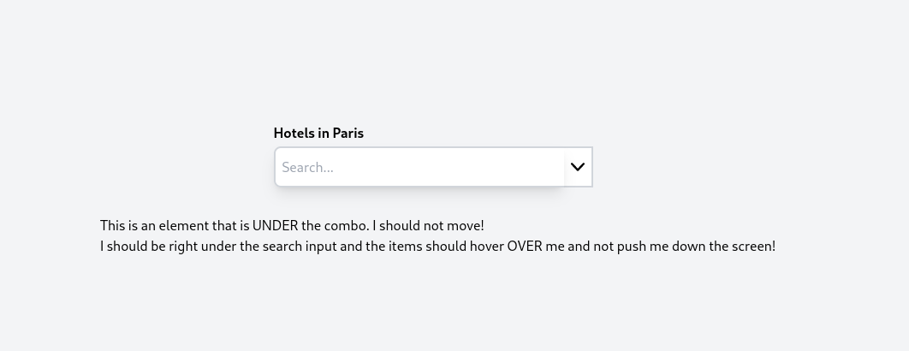
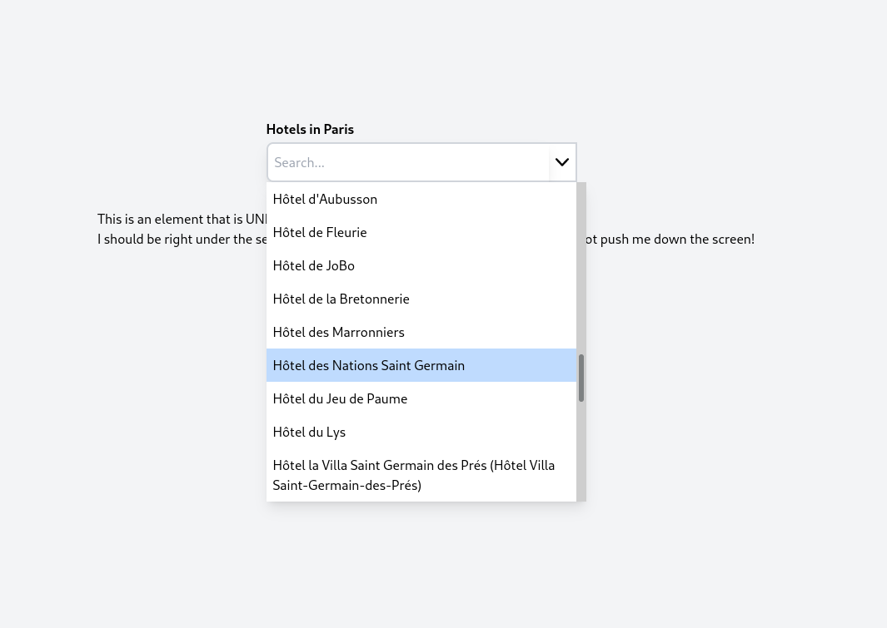
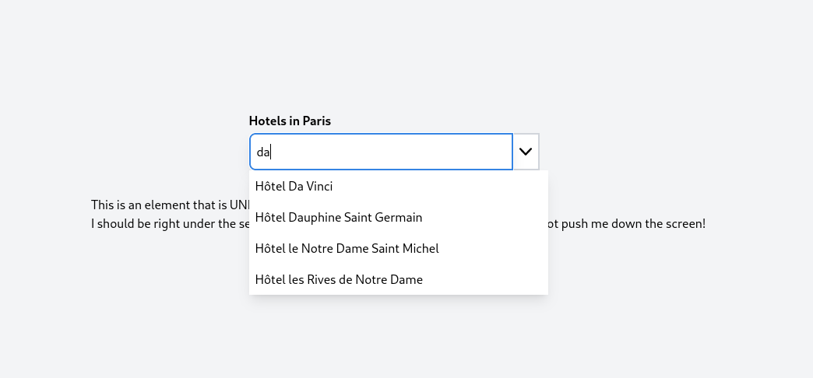

## HtmxCombo

Simple project to create a paginated combobox using Htmx and infinite scroll. This project uses Spring as the back end
and Thymeleaf as the templating engine.

Enjoy.

### Basic Tailwind layout. As an example, we're searching for hotels in Paris.

### Active search with arrow and cursor key movement

### Features

1. Active search with common Spring MVC pagination, etc. Can easily use any back end you like such as Django or Ruby on
   Rails.
2. Template is pretty simple with Thymeleaf. The actual HTML files are very minimal and should be easy to figure out.
3. Uses Tailwind CSS but this is not required. Just change out the classes to whatever you like.
4. You can up or down arrow through the list and press enter to select. Or, you can simply click on the item you want.
5. Once an item is selected, it performs a very basic lookup based on the ID. This can easily be changed to your back
   end system of choice.

### Issues

1. I need to implement closing the search items when the input box looses focus. Just haven't had time to work on this
   yet.
2. You can see a slight glitch when you select an item, delete it with the keyboard, then arrow down. The glitch is on
   the first item for a brief second.
3. I'm not a CSS/Tailwind expert. I'm sure this could be made better.

cbmeeks@gmail.com
